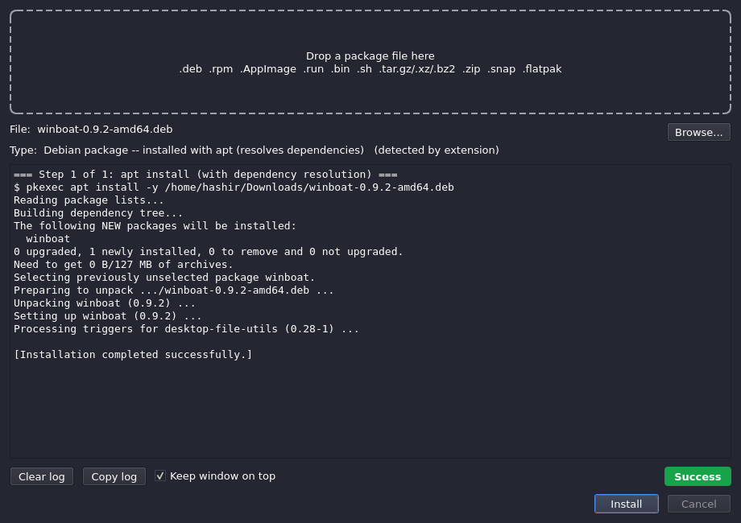

<div align="center">

# KUPI — Kali Universal Package Installer

**Drop any Linux package file onto one window and install it, with live terminal output the whole time.**

[](https://github.com/HashirAhmad-dev/kali-universal-installer/actions/workflows/ci.yml)
[](https://github.com/HashirAhmad-dev/kali-universal-installer/releases)
[](LICENSE)
[](https://www.python.org/)
[](https://doc.qt.io/qtforpython/)



</div>

---

KUPI is a native Qt desktop app for Kali Linux (and Debian derivatives). It detects the
type of any package file you drop on it, shows you exactly what it will run, and — on an
explicit **Install** click — executes the right commands while streaming their combined
stdout/stderr into the window in real time, so a failed install is visible and debuggable
instead of a silent error dialog.

No Electron. No Flutter. One window, one dependency (PySide6), one `QProcess`.

## Features

- **One drop zone for everything** — `.deb`, `.rpm`, `.AppImage`, `.run`, `.bin`, `.sh`,
  `.tar.{gz,xz,bz2,zst}`, `.tgz`, `.zip`, `.snap`, `.flatpak`, `.flatpakref`.
- **Live output** — merged channels via `QProcess`, streamed line by line, never buffered
  to the end. Auto-scroll, clear/copy log, **Cancel**.
- **Honest status** — exit code 0 is not blindly trusted: the output is scanned for
  `E:` / `Errors were encountered` lines and reported as *Success (with warnings)*.
- **Preflight, not surprises** — you see the detected type and the exact command before
  anything runs; per-format prompts (run as user or root? run the AppImage or install it?
  install the missing `alien`/`snapd`/`flatpak`?).
- **Archives are unpacked and re-dispatched** — a tarball or zip is extracted, scanned for
  an `install.sh` / `setup.sh` or a bundled `.deb`, and that is run through the matching
  handler; otherwise the files are moved to a folder you choose.
- **pkexec, not sudo** — privilege escalation uses the native polkit prompt, no password
  widget, no TTY.
- **Pluggable** — one small `PackageHandler` subclass per format
  ([how to add one](CONTRIBUTING.md#adding-a-package-handler)).

## Supported formats

| File type | What KUPI does |
|---|---|
| `.deb` | `pkexec apt install -y <file>` (apt resolves dependencies; `dpkg -i` would not) |
| `.rpm` | offers to install `alien` if missing, then `pkexec alien --install <file>` |
| `.AppImage` | choice: **run in place** (`chmod +x`, exec; auto-retries `--appimage-extract-and-run` if FUSE is missing) or **install** to `~/Applications` + write a `.desktop` launcher |
| `.run` / `.bin` | risk-acknowledgement prompt + user/root choice, then `chmod +x` and execute |
| `.sh` | `chmod +x` then `bash <file>` in the script's own directory; user/root choice |
| `.tar.*` / `.tgz` / `.zip` | extract → scan → dispatch `install.sh`/`setup.sh` or bundled `.deb`; else move to a chosen folder |
| `.snap` | offers to install `snapd` if missing, then `pkexec snap install --dangerous <file>` |
| `.flatpak` / `.flatpakref` | offers to install `flatpak` if missing, then `flatpak install --user -y <file>` (no root) |

Full details and the exact command sequences: [`docs/FORMATS.md`](docs/FORMATS.md).

## Installation

### From a release `.deb` (recommended)

Download the latest `kupi_*_all.deb` from the
[**Releases**](https://github.com/HashirAhmad-dev/kali-universal-installer/releases) page, then:

```bash
sudo apt install ./kupi_1.0.0_all.deb
```

`apt` pulls the runtime dependencies (`python3-pyside6.qtwidgets`, `pkexec`, `file`).
Launch **KUPI** from the application menu, run `kupi` in a terminal, or right-click a
package in your file manager → *Open With → KUPI*.

Uninstall with `sudo apt remove kupi`.

### Build the `.deb` yourself

```bash
git clone https://github.com/HashirAhmad-dev/kali-universal-installer.git
cd kali-universal-installer
./build-deb.sh                 # -> dist/kupi_1.0.0_all.deb
sudo apt install ./dist/kupi_1.0.0_all.deb
```

Requires `dpkg-dev` (for `dpkg-deb`); `lintian` is used if present. See
[`docs/PACKAGING.md`](docs/PACKAGING.md).

### Run from source (development)

```bash
./run.sh                       # creates .venv on first run, then launches
./run.sh path/to/package.deb   # preload a file
./install-desktop.sh           # per-user menu entry (./install-desktop.sh --remove to undo)
```

## Usage

1. **Drop** a package file on the window (or use **Browse…**, or launch with a path).
2. Read the detected **type** and the command KUPI will run.
3. Click **Install**. Answer any preflight prompt (polkit will ask for your password if
   the step needs root).
4. Watch the output. The status pill goes **Running → Success / Success (with warnings) /
   Failed**. **Cancel** kills the running step.

> **Cancel + pkexec:** killing a `pkexec` step signals the wrapper, not the privileged
> child it spawned — apt/dpkg may finish in the background. KUPI says so in the log.

## Documentation

| Document | Contents |
|---|---|
| [`docs/FORMATS.md`](docs/FORMATS.md) | Every supported format, its preflight prompts, and the exact command plan |
| [`docs/ARCHITECTURE.md`](docs/ARCHITECTURE.md) | The handler contract, the execution engine, the archive re-dispatch flow |
| [`docs/PACKAGING.md`](docs/PACKAGING.md) | Building the `.deb`, the installed layout, cutting a release |
| [`docs/QA.md`](docs/QA.md) | The QA report: what is covered by automated tests and what needs manual checks |
| [`CONTRIBUTING.md`](CONTRIBUTING.md) | Dev setup, running tests, adding a new package handler |
| [`CHANGELOG.md`](CHANGELOG.md) | Release history |
| [`SECURITY.md`](SECURITY.md) | Reporting vulnerabilities; the trust model |

## Testing

```bash
python -m pytest                    # if pytest is installed
# or, dependency-free:
python tests/test_detector.py
python tests/test_handlers.py
python tests/test_integration.py    # needs PySide6 (offscreen Qt)
```

## Requirements

- Kali Linux / Debian / Ubuntu with a desktop session and a running polkit agent
- Python 3.10+
- PySide6 6.7+ (`python3-pyside6.qtwidgets` from the distro, or `pip install PySide6`)
- `pkexec`, `file`, `tar`; `unzip` for `.zip`; `alien` / `snapd` / `flatpak` are pulled
  in on demand

## License

[MIT](LICENSE) © 2026 Prismovector
